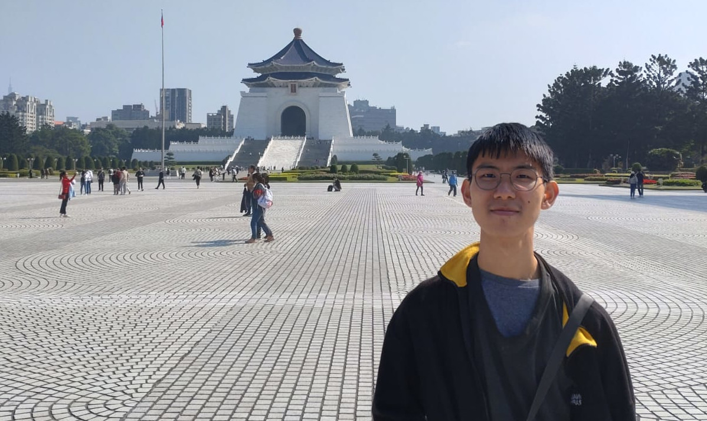

Hi! I'm Tobias Sung (宋士衡). I was born and raised in Hong Kong, but I grew up in an English-speaking family so English is essentially my native language (though thanks to my schooling I'm quite fluent in Chinese too.)   Ever since learning Pascal in high school, I became fascinated by the world of computer programming. I went on to study Computer Engineering at The University of Hong Kong. It was there that I learned how much code runs behind the scenes of our daily life, and that programming goes far beyond the pretty apps and websites we see on our computers and smartphones. It live in our buses and cars, our kitchen appliances, even our toilets! It was then that I became interested in focusing on embedded systems.  Another interest that arose during college: technical communication. There were a lot of difficult technical subjects I had to learn, and the main reason I was able to pass all of them was because of all the incredibly well-made (and free!) educational resources online. YouTube channels like <a href="https://www.youtube.com/@3blue1brown/videos">3blue1brown</a> and <a href="https://www.youtube.com/@BrianBDouglas">Brian Dogulas</a> were an especially huge influence on me. Later, when using open-source resources to work on technical projects, I was always in awe of how well-written their READMEs were, making it simple for anyone to use and expand their work. Knowledge sharing is the cornerstone for building a better world, even in the smallest things, and I hope to be just a small part of that through my own writing and video work.

你好！我是宋士衡，是在香港出生長大的,但是家裏都是說英文的，所以英語是我的母語（不過因爲在本地學校上學，我的中文還不錯！）。我2023年大學畢業後跟家人搬來臺灣，因爲這裏有比較多工作機會給工程師。  自從在高中學Pascal，我就對程式設計的世界充滿好奇心。我在香港大學讀了計算機工程系(Computer Engineering)，並從中發現程式不僅是我們電腦跟手機上那些漂漂亮亮的網頁跟APP。我們日常生活中的背後原來有真麼多的程式在默默地爲我們服務！程式碼活在我們的車子，活在我們的家電，甚至活在我們的廁所！從此，我就開始特別對嵌入式系統有興趣。  我的另一個興趣就是技術傳播。不論在大學或是在做專案，我都需要學習很多技術性課題，如果沒有網上多元的教學材料我一定沒有辦法學會！我每次需要使用到一些開元軟體，我都很佩服他們怎麼在README裏這麼清楚地解釋用法跟背後的原理，讓任何人輕易的使用跟更改。知識傳播是發展的基石，我也期望可以通過自己的寫作與影片有小小的貢獻。

